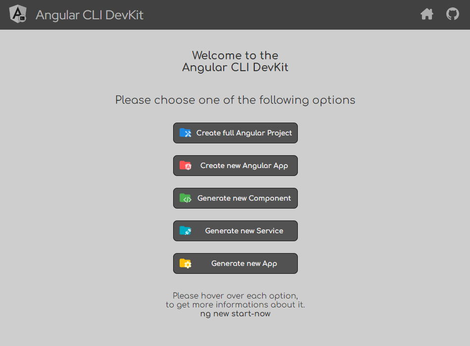

# Angular CLI DevKit

### What is **Angular CLI DevKit**?

In short: **Angular CLI DevKit** is an Angular-based web application, which offers the ability to create command prompts for the Angular CLI via a graphical user interface. With the **Angular CLI DevKit**, new workspaces, new components, new services, etc. can be created in this way. 
  

### Okay ... tell me more

While I was learning Angular, I quickly realized how powerful the Angular CLI is. However, I often had to read the official documentation because I simply couldn't memorize all the commands. So I started writing little Powershell scripts to help me create new projects, generate new components, create new services and everything else you can do with the Angular CLI. But this whole collection of scripts simply became extremely impractical at some point.
  
So I thought about it and finally decided to create my own web application that would allow me to generate prompts for the Angular CLI quickly and easily. And what could be better suited for such a web application than Angular 😉.
   

### What can the **Angular CLI DevKit** do?

Well ... a picture can say more than words. And that's why here is a screenshot of the main page of the **Angular CLI DevKit**
  

Actually, this little project was supposed to be just for myself and I didn't plan to release this app.  But in the end I liked it so much that I thought: "I'll just publish it on GitHub.".
  

### So what are the next steps?

The **Angular CLI DevKit** is almost finished so I am practically close to releasing a first version. But there are still a few little things to do. Not everything still works and a few functionalities are still missing. There are also a few minor bugs/issues that I still need to fix. I plan to have a first official version ready by the beginning of February. Just stop by any time. Happy to see you again 😊

<!--
> [!NOTE]
> ... more stuff is coming soon ...
-->

